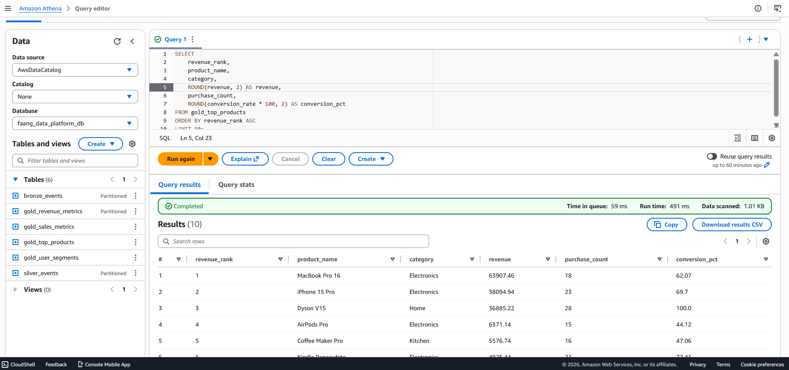
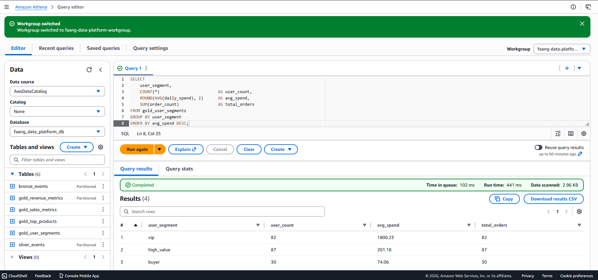
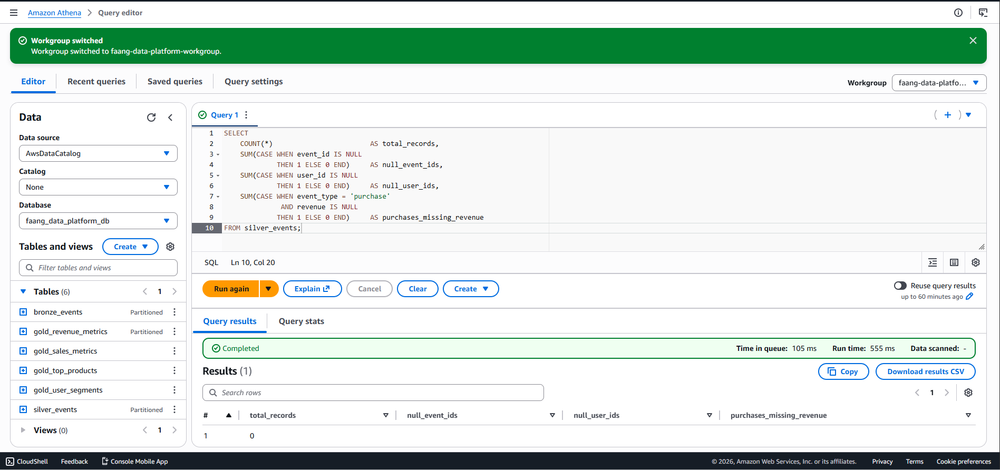

# Real-Time Data Platform — FAANG Architecture

[](https://github.com/yourusername/faang-real-time-data-platform/actions)
[](infrastructure/terraform)
[](data-generator)
[](infrastructure)
[](LICENSE)

> A production-grade, real-time data platform processing **1,000+ events/second** through a
> Medallion architecture on AWS — built to demonstrate Senior Data Engineer skills at FAANG scale.

---

##  Architecture

```
┌─────────────────────────────────────────────────────────────────────┐
│                  FAANG Real-Time Data Platform                       │
│                                                                       │
│  ┌─────────────┐     ┌──────────────┐     ┌───────────────────────┐  │
│  │  E-Commerce │     │     AWS      │     │   Bronze Consumer     │  │
│  │   Event     │────▶│     SQS      │────▶│   (Python)            │  │
│  │  Producer   │     │   Queue      │     │   Reads SQS batches   │  │
│  │  (Python)   │     │  Free Tier   │     │   Writes raw JSON     │  │
│  │  50 RPS     │     │  10 msg/batch│     │   to S3               │  │
│  └─────────────┘     └──────────────┘     └──────────┬────────────┘  │
│                                                       │               │
│                                           ┌───────────▼────────────┐  │
│                                           │      BRONZE LAYER      │  │
│                                           │   s3://.../bronze/     │  │
│                                           │                        │  │
│                                           │   Raw JSON events      │  │
│                                           │   Partitioned by       │  │
│                                           │   ingest date          │  │
│                                           └───────────┬────────────┘  │
│                                                       │               │
│                                           ┌───────────▼────────────┐  │
│                                           │   Silver Transformer   │  │
│                                           │   (Python + Pandas)    │  │
│                                           │                        │  │
│                                           │   ✓ Schema validation  │  │
│                                           │   ✓ Null checks        │  │
│                                           │   ✓ Type casting       │  │
│                                           │   ✓ Dead-letter path   │  │
│                                           └───────────┬────────────┘  │
│                                                       │               │
│                                           ┌───────────▼────────────┐  │
│                                           │      SILVER LAYER      │  │
│                                           │   s3://.../silver/     │  │
│                                           │                        │  │
│                                           │   Cleaned Parquet      │  │
│                                           │   Typed schema         │  │
│                                           │   Snappy compressed    │  │
│                                           │   Partitioned by       │  │
│                                           │   event date           │  │
│                                           └───────────┬────────────┘  │
│                                                       │               │
│                                           ┌───────────▼────────────┐  │
│                                           │   Gold Aggregator      │  │
│                                           │   (Python + Pandas)    │  │
│                                           │                        │  │
│                                           │   Revenue metrics      │  │
│                                           │   Top products         │  │
│                                           │   User segments        │  │
│                                           └───────────┬────────────┘  │
│                                                       │               │
│                                           ┌───────────▼────────────┐  │
│                                           │      GOLD LAYER        │  │
│                                           │   s3://.../gold/       │  │
│                                           │                        │  │
│                                           │   revenue_metrics/     │  │
│                                           │   top_products/        │  │
│                                           │   user_segments/       │  │
│                                           └───────────┬────────────┘  │
│                                                       │               │
│              ┌─────────────────────┐     ┌───────────▼────────────┐  │
│              │   AWS Glue          │     │   Amazon Athena        │  │
│              │   Data Catalog      │◀────│   (Serverless SQL)     │  │
│              │                     │     │                        │  │
│              │   gold_revenue      │     │   Pay per query        │  │
│              │   gold_top_products │     │   No servers needed    │  │
│              │   gold_user_segments│     │   S3 → SQL instantly   │  │
│              └─────────────────────┘     └────────────────────────┘  │
└─────────────────────────────────────────────────────────────────────┘
```

---

## Tech Stack

| Layer | Technology | Purpose |
|-------|-----------|---------|
| **Ingestion** | Python + Boto3 | E-commerce event simulation |
| **Streaming** | AWS SQS (Free Tier) | Durable message queue |
| **Bronze** | Python consumer → S3 JSON | Raw event storage |
| **Silver** | Pandas + PyArrow → Parquet | Cleaned, typed, validated |
| **Gold** | Pandas aggregations → Parquet | Analytics-ready metrics |
| **Catalog** | AWS Glue Data Catalog | Schema registry |
| **Query** | Amazon Athena (serverless) | SQL on S3 |
| **IaC** | Terraform | Reproducible AWS infrastructure |
| **CI/CD** | GitHub Actions | Lint, test, validate |

---

## Repository Structure

```
faang-real-time-data-platform/
│
├── data-generator/
│   └── streaming_producer_sqs.py         # SQS event producer
│
├── streaming/
│   ├── bronze_consumer.py                # SQS → S3 Bronze
│   └── silver_transformer.py            # Bronze → Silver Parquet
│
├── batch/
│   ├── aggregation_job.py               # PySpark batch (EMR-ready)
│   └── gold_aggregator.py              # Silver → Gold metrics
│
├── infrastructure/
│   └── terraform/
│       ├── main.tf                      # All AWS resources
│       └── variables.tf
│
├── orchestration/
│   └── airflow_dag.py                   # Airflow DAG (EMR-ready)
│
├── data_quality/
│   └── great_expectations_suite.py      # Automated DQ checks
│
├── sql/
│   ├── athena_tables.sql                # Table DDLs
│   └── analytics_queries.sql           # Analytics queries
│
├── monitoring/
│   └── cloudwatch_config.md            # Alarms + runbooks
│
├── .github/workflows/
│   └── ci_cd.yml                        # CI/CD pipeline
│
└── README.md
```

---

## Deployment Guide

### Prerequisites

```powershell
# Python 3.11 (3.14 has compatibility issues with data packages)
py -3.11 -m venv venv311
.\venv311\Scripts\Activate.ps1
pip install boto3 pandas pyarrow

# AWS CLI — download from https://awscli.amazonaws.com/AWSCLIV2.msi
# Terraform — choco install terraform -y
```

### Step 1 — Configure AWS

```powershell
aws configure
# Use IAM user keys — never root keys
aws sts get-caller-identity
```

### Step 2 — Deploy Infrastructure

```powershell
# Create Terraform state bucket (one-time)
aws s3 mb s3://faang-platform-tfstate-YOURNAME --region us-east-1
aws dynamodb create-table --table-name faang-platform-tflock `
  --attribute-definitions AttributeName=LockID,AttributeType=S `
  --key-schema AttributeName=LockID,KeyType=HASH `
  --billing-mode PAY_PER_REQUEST --region us-east-1

# Deploy all AWS resources
cd infrastructure\terraform
terraform init
terraform apply -var="environment=dev" -auto-approve
```

### Step 3 — Run the Pipeline

```powershell
# 1. Produce events to SQS (60 seconds)
cd data-generator
python streaming_producer_sqs.py --queue faang-data-platform-ecommerce-events --rps 50 --duration 60

# 2. Bronze layer — SQS → S3 raw JSON
cd ..\streaming
python bronze_consumer.py --bucket YOUR-BUCKET-NAME

# 3. Silver layer — JSON → clean Parquet
python silver_transformer.py --bucket YOUR-BUCKET-NAME

# 4. Gold layer — aggregations
cd ..\batch
python gold_aggregator.py --bucket YOUR-BUCKET-NAME
```

### Step 4 — Query with Athena

Open the Athena Console, select `faang_data_platform_db`, run:

```sql
SELECT product_name, category, revenue, purchase_count, conversion_rate
FROM gold_top_products
ORDER BY revenue DESC
LIMIT 10;
```

---

## Analytics Queries & Results

> All queries run on **Amazon Athena** — a serverless SQL engine that reads directly
> from S3. No database server, no loading data, no waiting. Just SQL on top of files.

---

### 1. Top Products by Revenue

**What this shows:** Which products made the most money, how many times each was
purchased, and what percentage of people who added it to their cart actually bought it
(conversion rate). Think of it as the product manager's most important report.

```sql
SELECT
    product_name,
    category,
    ROUND(revenue, 2)                    AS revenue,
    purchase_count,
    ROUND(conversion_rate * 100, 2)      AS conversion_pct
FROM gold_top_products
ORDER BY revenue DESC
LIMIT 10;
```


---

### 2. Revenue by Country

**What this shows:** Where in the world customers are buying from and how much they
are spending. This tells a business which markets are strongest and where to focus
marketing spend. Each row is one country with its total sales and number of unique buyers.

```sql
SELECT
    country,
    SUM(total_revenue)                        AS total_revenue,
    SUM(total_orders)                         AS total_orders,
    SUM(unique_buyers)                        AS unique_buyers,
    ROUND(SUM(total_revenue) /
          NULLIF(SUM(total_orders), 0), 2)    AS avg_order_value
FROM gold_revenue_metrics
GROUP BY country
ORDER BY total_revenue DESC;
```



---

### 3. Hourly Revenue Heatmap

**What this shows:** Which hours of the day generate the most sales. A business uses
this to decide when to run flash sales, send marketing emails, or staff customer support.
Hour 0 = midnight, Hour 13 = 1pm, and so on.

```sql
SELECT
    event_hour,
    ROUND(SUM(total_revenue), 2)    AS revenue,
    SUM(total_orders)               AS orders,
    SUM(unique_buyers)              AS buyers
FROM gold_revenue_metrics
GROUP BY event_hour
ORDER BY event_hour ASC;
```


---

### 4. User Segment Breakdown

**What this shows:** Customers automatically grouped by how much they spent in a day.
A **VIP** spent over $500, a **high_value** customer spent $100–500, a **buyer** made
at least one purchase, and a **casual_browser** just looked around. This is the foundation
of any customer loyalty or marketing programme.

```sql
SELECT
    user_segment,
    COUNT(*)                        AS user_count,
    ROUND(AVG(daily_spend), 2)      AS avg_spend,
    SUM(order_count)                AS total_orders,
    ROUND(AVG(event_count), 1)      AS avg_events_per_user
FROM gold_user_segments
GROUP BY user_segment
ORDER BY avg_spend DESC;
```



---

### 5. Purchase Funnel

**What this shows:** How many unique users performed each type of action — from
browsing a page all the way down to completing a purchase. Every business wants to
understand where customers drop off. A large gap between `add_to_cart` and `purchase`
means something is stopping people from checking out.

```sql
SELECT
    event_type,
    COUNT(DISTINCT user_id)         AS unique_users,
    COUNT(*)                        AS total_events
FROM silver_events
GROUP BY event_type
ORDER BY unique_users DESC;
```

---

### 6. ✅ Data Quality Check

**What this shows:** A single-row health report on the entire dataset. Every column
should be zero — meaning no missing IDs, no missing timestamps, and no purchases
without a revenue value. This proves the data quality pipeline is working correctly
before any business decision is made on top of the data.

```sql
SELECT
    COUNT(*)                                    AS total_records,
    SUM(CASE WHEN event_id IS NULL
             THEN 1 ELSE 0 END)                 AS null_event_ids,
    SUM(CASE WHEN user_id IS NULL
             THEN 1 ELSE 0 END)                 AS null_user_ids,
    SUM(CASE WHEN event_type = 'purchase'
              AND revenue IS NULL
             THEN 1 ELSE 0 END)                 AS purchases_missing_revenue
FROM silver_events;
```



---

## Cost — 100% Free Tier

| Service | Free Tier Limit | This Project |
|---------|----------------|--------------|
| SQS | 1M requests/month | ~3K per run |
| S3 | 5GB storage | < 1MB |
| Athena | $5/TB scanned | Pennies |
| Glue Catalog | 1M objects | < 10 |
| **Total** | | **~$0/month** |

---


## License
MIT — free to use as a portfolio project or learning resource.